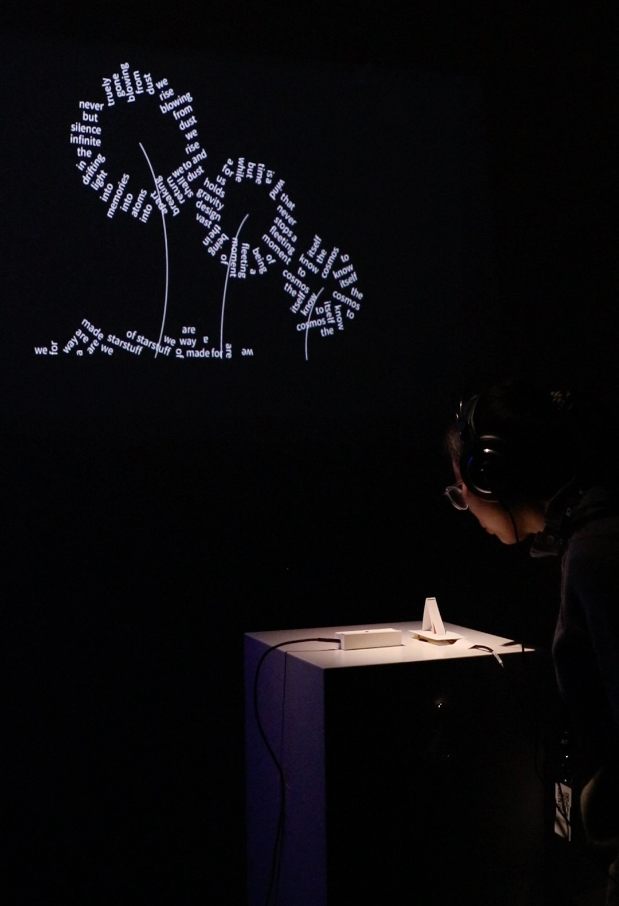
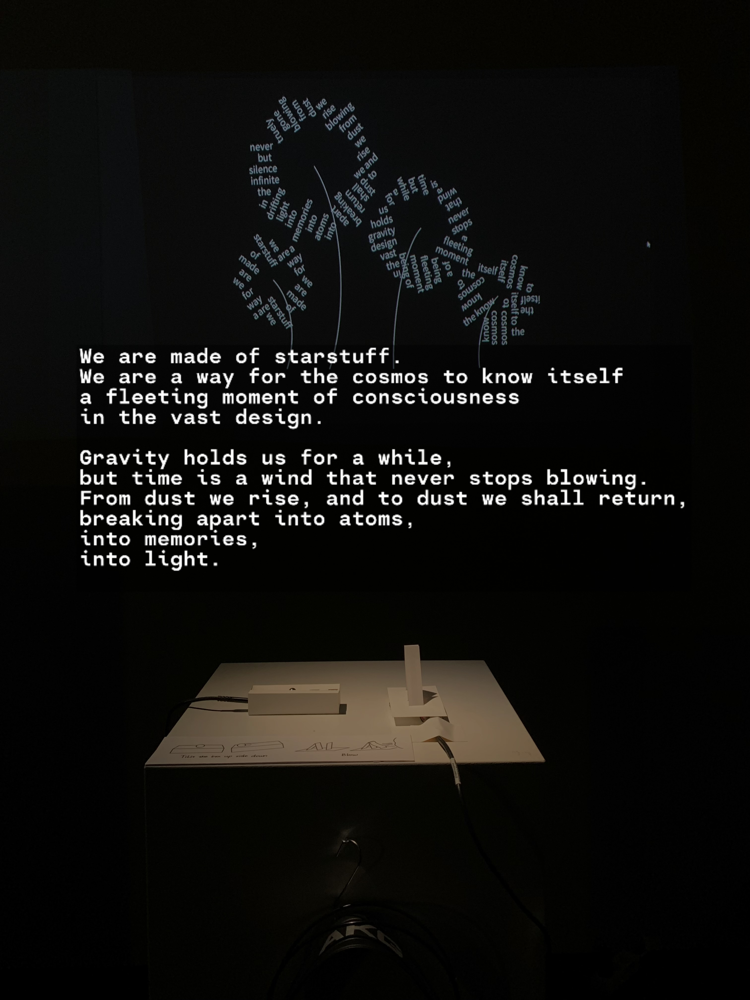

# Metaphor

  <iframe
    src="https://www.youtube.com/embed/-mmZ1Sh2Hec"
    style="position:absolute;top:0;left:0;width:100%;height:100%;"
    frameborder="0"
    allow="accelerometer; autoplay; clipboard-write; encrypted-media; gyroscope; picture-in-picture"
    allowfullscreen>
  </iframe>

This work treats language as matter and metaphor as form. It is an exploration of existence, time, and the fragility of consciousness through a typographic and interactive calligram.

The text draws from a cosmic perspective: “We are made of starstuff.” Humanity is understood as a fleeting configuration of the universe—an instant in which the cosmos becomes aware of itself. The words are composed into the image of a dandelion, a symbol of impermanence and dispersal. Though visually complete, the form is always on the verge of disintegration.

Audience interaction activates the work. A breath causes the words to detach and drift away, transforming language from a stable narrative into a physical substance that can fall, scatter, and disappear. As the letters reach the ground, they produce sound—echoes of breaking, of memory fragmenting, of atoms returning to light.

A controllable box alters the tilt of the floor, introducing gravity as a variable force. While gravity holds us only temporarily, time functions like an endless wind, continuously reshaping all forms. The movement of text across the space becomes both a physical event and a metaphorical passage.

Here, metaphor is no longer rhetorical but spatial; the calligram is no longer static but performative. The work invites viewers to experience how meaning, like matter, briefly takes shape—before inevitably dissolving back into dust, memory, and light.

