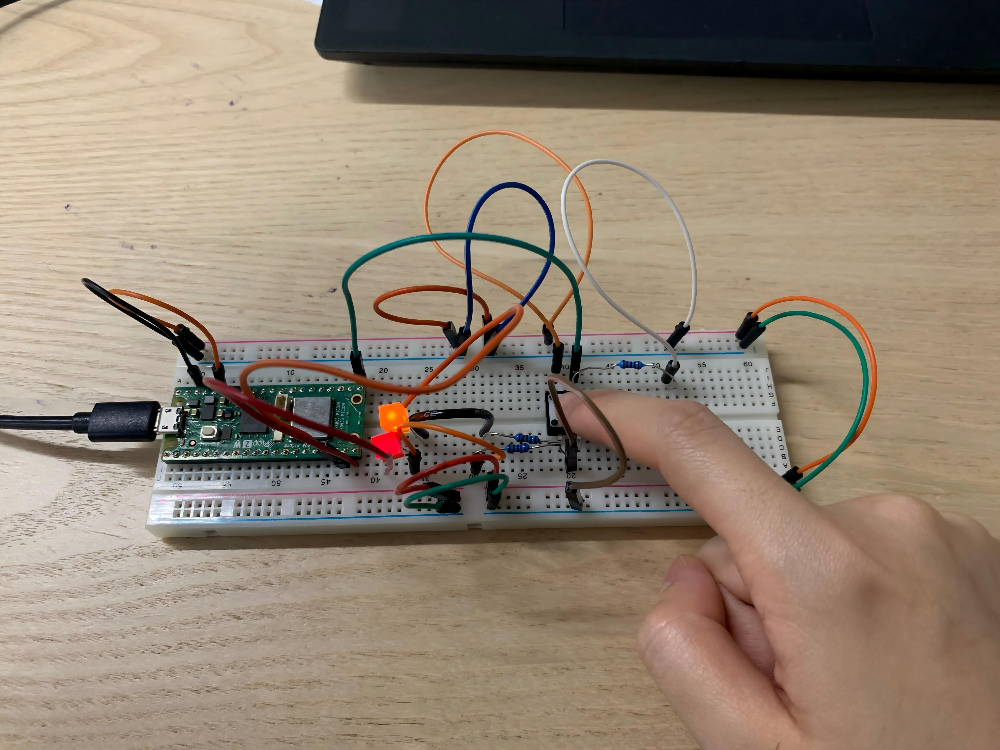
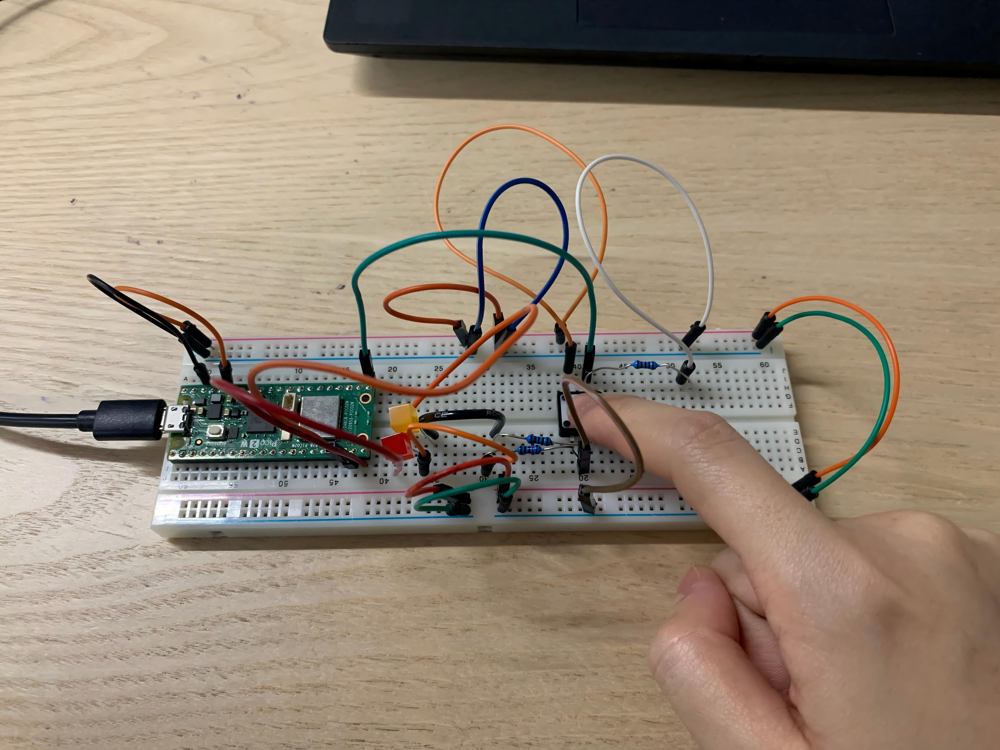

### Code

```
int i=0;
int lastButtonState = LOW;
int currentButtonState;

void setup() {
// initialize digital pin LED_BUILTIN as an output.
pinMode(15, OUTPUT);
pinMode(14, OUTPUT);
pinMode(16,INPUT);
digitalWrite(15,LOW);
digitalWrite(14,LOW);
Serial.begin(9600);
}

void loop() {
currentButtonState = digitalRead(16);
Serial.println(currentButtonState);
if(currentButtonState == HIGH && lastButtonState == LOW){
  i=i+1;
}
if(i>2){
  i=0;
}

lastButtonState = currentButtonState;

if(i==1){
  analogWrite(15,255);//analogWrite is value between 0-255
  analogWrite(14,0);
}
else if(i==2){
  analogWrite(14,255);
  analogWrite(15,255);
}
else if(i==0){
  analogWrite(14,0);
  analogWrite(15,0);
}
delay(50);//debuncing
}
```

### Self-Reflection - coding

#### The logic of hardware computing is the same with processing and Java

At first, I face some problem with coding because I am a new learning of coding(only java), so **it's hard for me to migrate knowledge from Java class to hardware computing**. My problem is that, I thought the actions, 2 times of pressing bottom, **transform the same HIGH signal to the Pico board, how can it be detected by the board into different information and trigger two LED?** But through the hint of my classmate, **counting**, I realize the logic is the same, **just use math**.

#### The if condition part

I find it hard to set the suitable if condition at first, this is my initial coding:

```
int i=0;
Button = digitalRead(16);
if(Button == 1){
  i=i+1;
}
if(Button == 0){
  i=0;
}
if(i==1){
  analogWrite(15,255);//analogWrite is value between 0-255
  analogWrite(14,0);
}
else if(i==2){
  analogWrite(14,255);
  analogWrite(15,255);
}
else if(i==0){
  analogWrite(14,0);
  analogWrite(15,0);
}
```

The problom of this is that the value of i will keep couting from 0 to 1, 2, 3, 4... And this will cause the LEDs only light up for a short second. So we need to stop the counting when i=2. And what we want is that only do the math when the last buttom state is LOW, the current state is HIGH, so I change the if condition.

## Circuit






### \
Question

* I have one problem: why we need introduce an other resistor for the second LED? Because I test only use one LED, it is still lighted up(but without the buttom control).

  
