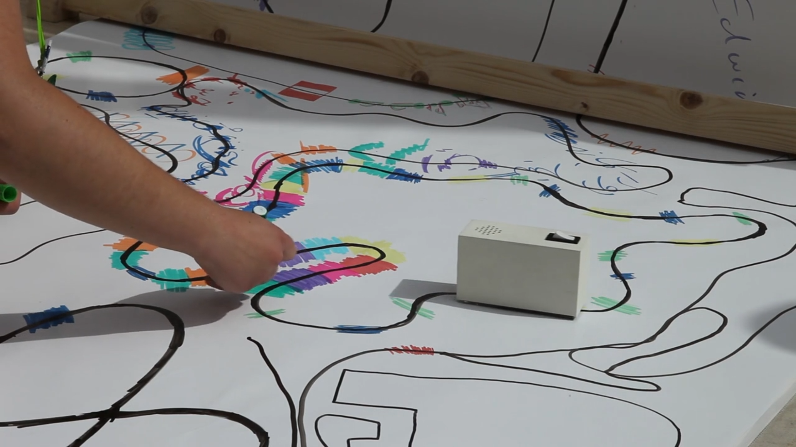

# Part I: Find an interesting existing Alt+Ctrl Interface

## Looks like Music by Yuri Suzuki

### Art Description

The artist features robots that are programmed to follow a black line drawn on white paper. They each respond with specific sounds as they pass over coloured marks laid down across the track by visitors.
The devices, called Colour Chasers, are each designed with different shapes and translate the colours they encounter into sounds including drums, deep bass, chords and melody.
Suzuki is gyslexic and cannot read musical scores, but he has a passion to play and create new music and always dream to create new notation of music. So he made this for people like him with no knowledge about musci making to discover the new method to create music.

*see the video and artist potfolio at: [https://yurisuzuki.com/artist/looks-like-music](https://yurisuzuki.com/artist/looks-like-music)*

### Imagine How he did that

* The movement of the robot: follow the black lines

  > * Components: RGB sensor + IR LED or IR Sensor Matrix
  > * My guess: From Matti, we know that this kind of sensor works by the reflection of light, so I guess there is an LED on the buttom of the robot, or he just use IR sensors to detect whether there is strong light reflected back(white) or all eaten by the surface(black). If the RGB sensors/IR sensors detect the color is black, then just keep walking straightly; if white, then it will tell the arduino board to turn a bit left/right, keeping tracking the black lines.
* Detect the colors and make sound

  > * Componets: RGB sensor(can be the APDS9960 we test) + IR LED + sound module
  > * My guess: Keep sending the light and recognize the color it goes through, and different color will triger differen sound record from the sound module.

### My Question

* How manny RGB sensors/IR sensor used in this to insure the movement of the robot smoothly?
* Idealy, people draw each color seperately so it can be clearly detected. But what about all the colors are mixed and overlap each other? Does this also works? Or it use the oily pen to avoid two color overlapped together and become sth else?
