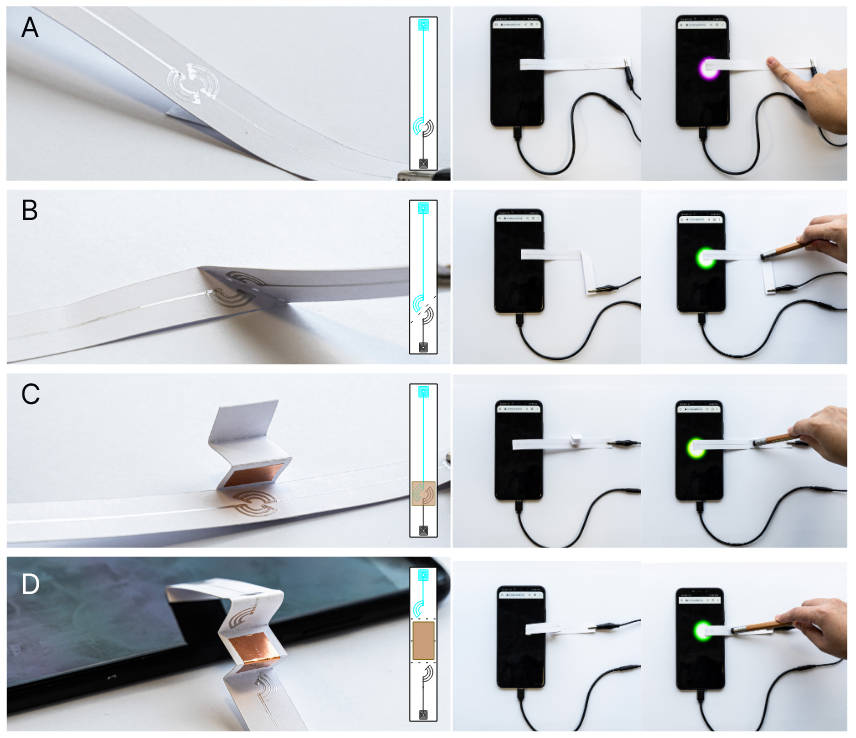
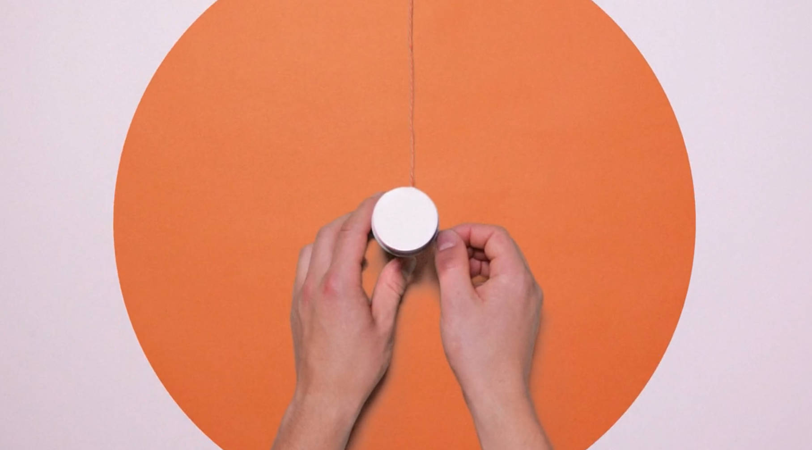
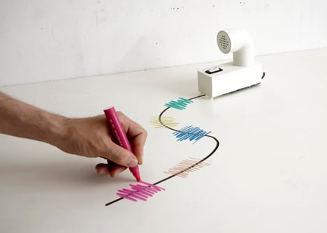
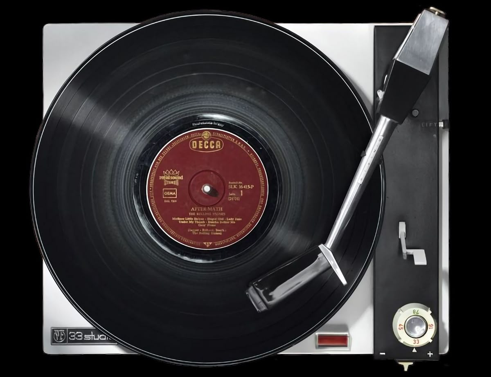
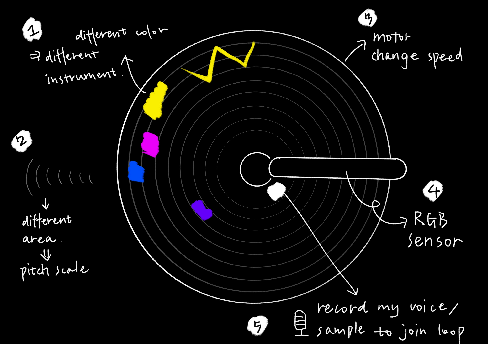
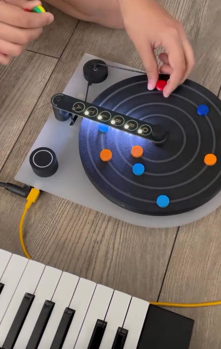
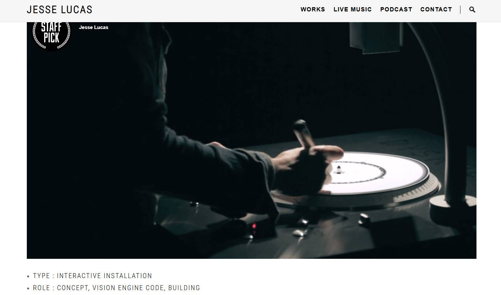

# Idea I: Metaphor

## Inspiration

\*see the video at: <https://www.are.na/block/3894857>*

## Simple Concept

The essence of "metaphor" is to use something familiar(A) to understand and express another abstract thing(B). In this project, our A can be the way people interact with paper: folding, pressing, blowing... I want to connect them with sounds and visuals, to create my own metaphor and my own tangible interface.

## Fabrication Concept

a Pull-Down Resistor + Rasberry PI PICO

> The pull-down resistor ensures the Arduino pin has a stable reading — **LOW when open**, **HIGH when closed** — making your paper-based switch reliable and responsive.

# Idea II: Chromatic Gramophone

## Inspiration

## Simple Concept

I want to create music but the music making softwares like Abletion is complicated to learn, so I want to introduce a simple and physical way to make music. And I watched a very simple way of creating music, called loop. Then the motor and the shape of gramohone makes this a perfect physica way of creating loop.
<https://youtube.com/shorts/5h5m3fB_8ZE?si=OLcgfcQB7sZwaUNg>

## The Problem is....

After I came up with it, I then find two artists have something similar:

1.Cay Taylan: jamming with Orbita MIDI sequencer together with his daughter

2.Jesse Lucas: DYSKOGRAF

click to jump to the artist website: <https://eyehear.org/portfolio/dyskograf/>
