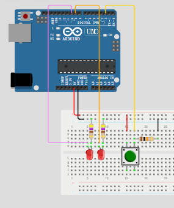
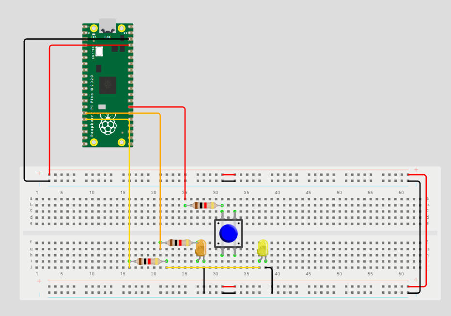

# My question about the Firt LED-Switch Assignment:

## Why the resisor for the switch need to put here?

Matti's example:(resistor on the negative side and connected with PICO)`

why can't it be like this? the resistor on the positive side connected with PICO?

* Two functions of the resistors:

  > 1. **Limits the current flowing** through the components.
  > 2. Make sure the digital pin has a clear level state when the button is not pressed.

For the first function, it works for the both way. And for the latter one, it also works, but the serial the 2 send are in the opposite way:

> 1. Matti's way - **pull-down resistor**: The resistor is connected between the signal line and GND; Press -> HIGH; Un-Press -> LOW;
> 2. Mine way - **pull-up resistor**: The resistor is connected between the signal line and $\text{VCC}$/positive pole; Press -> LOW; Un-Press -> HIGH;
