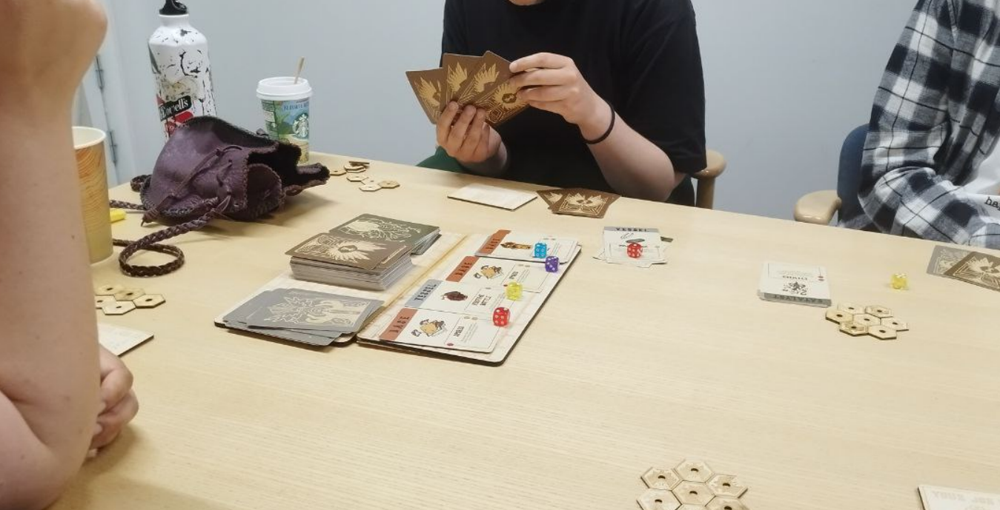
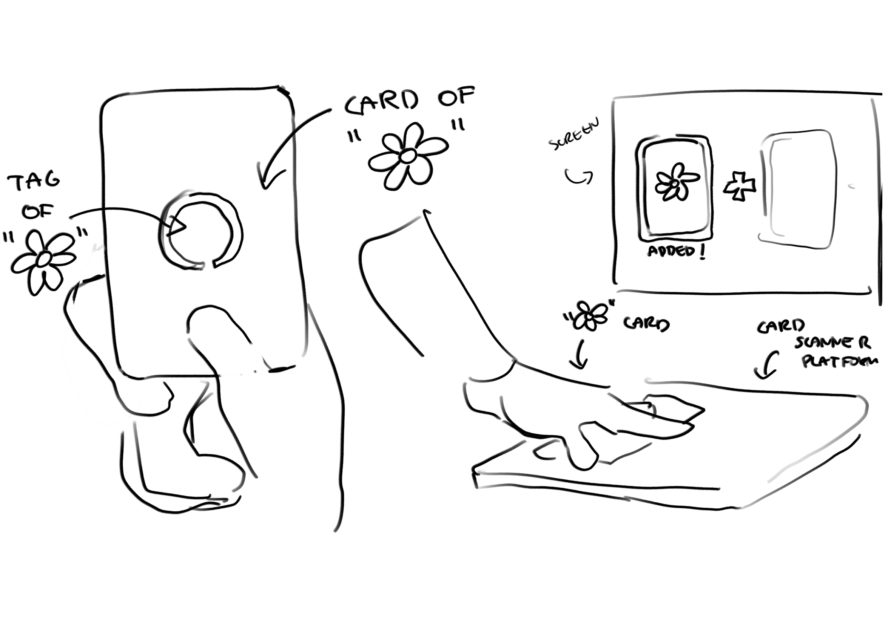
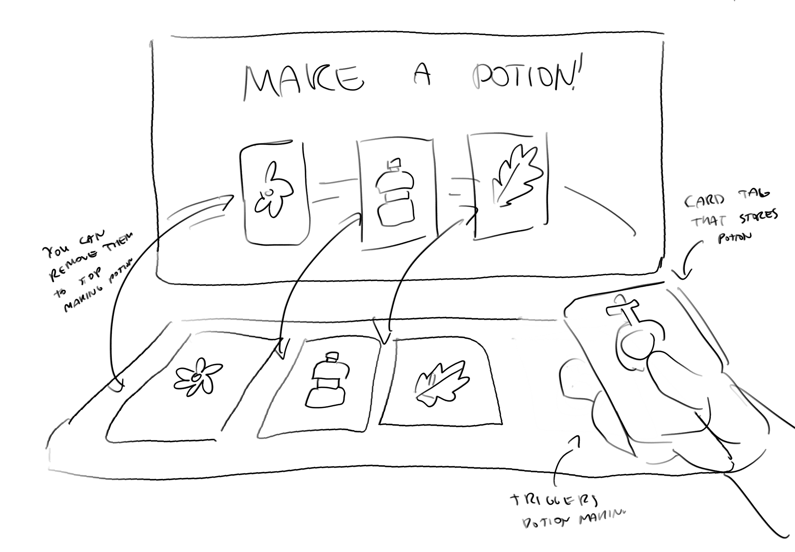
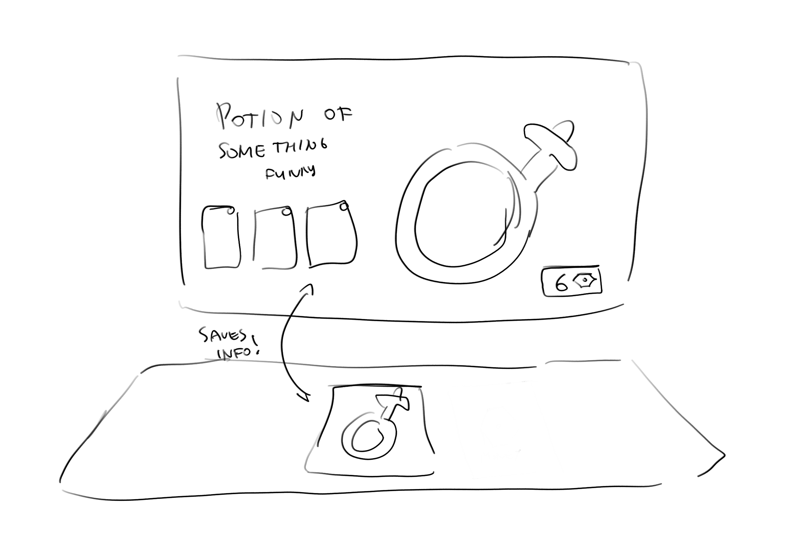
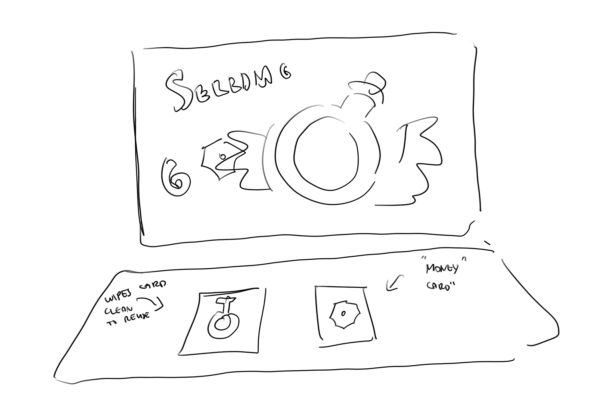

The idea I have in my project is based on digitalization of my previous project from my bachelor, the board game called **"Bargain's Alchemy"**.

 The game's idea is to create a loop of potion creation and selling it to earn money as the final goal. 

My desire is to **combine physical cards from the game and create a direct connection with the digital version.**

## My main aims in this project are:

* Create a software and tag system that is able to recognize cards upon being scanned

* Be able to combine different cards to create "potion making mechanic", where ingredients correlate with physical cards

* Store created potion in a new "potion card" to view after 

* To be able to "sell potions" and wiping off the "potion" card to restart the game system

As far as I am aware, it should be possible, and I already have most of the cards and visual prepared, which only leads to coding and physical computation aspects of the project.

## It should be possible to achieve with this physical components:

* Tag reader/scanner
* Screen
* Tags to attach upon the cards

The main hurdle is the creation of software to run it, but I believe it should be possible by combining both **Physical Computation** and **Design** computation projects together.
