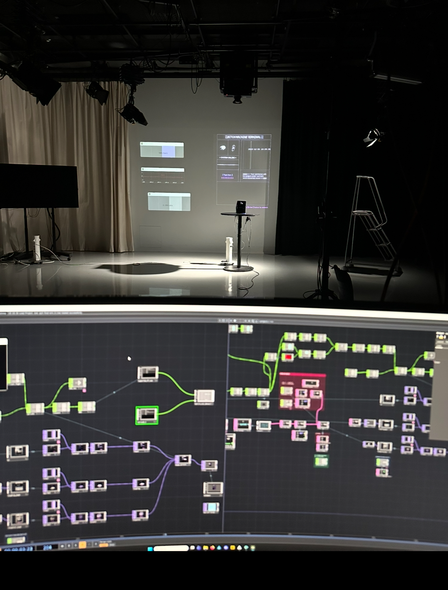
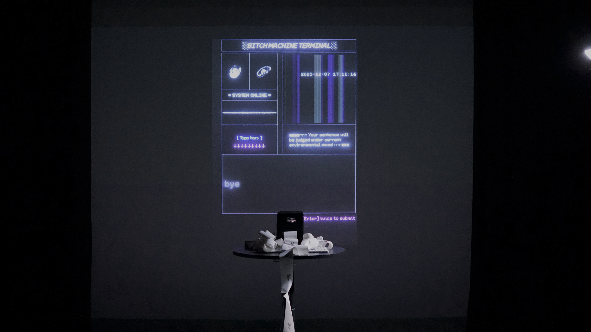

## When Language Warps / A Bitch Machine

This project is officially called When Language Warps, but I usually just call it the Bitch Machine.

## Introduction

It is an interactive installation that reveals how environments response to what we say.

The system shifts its persona between three “bitch modes”, according to ambient light and sound, responding to the user’s input with intentional malice and bias. It works like an environment translator—once a sentence leaves us, it gets reshaped by the environment’s emotions, biases, and attitudes.

It reflects a growing reality: we are becoming accustomed to a world that answers us with prejudice—and increasingly numb to that prejudice itself. Over time, we get used to hostile or twisted responses, We start to go quiet, and only say things that feel “safe enough” for the environment.

## How It works

The system’s responses are generated by ChatGPT 5.0.

By collecting and analyzing various forms of online hostility, I constructed a prompt that embodies different “bitch” personas.

These personas are continuously modulated by environmental sensor data, translated into an Environmental Intensity Score (EIS), which defines the system’s current mode.

The whole system runs as a loop:

> the environment pushes → you get irritated → you respond → the environment magnify  the hostility → you react again → and everything keeps escalating.

After each interaction, the system prints a backend log based on the current environmental state. The receipt allows the audience to see details such as the Bitch Mode, Bias Style, and Pressure Tone.

#### Device components

> Light Dependent Resistor
>
> Microphone (Zoom H5 kit)
>
> Thermal printer
>
> Keyboard
>
> Spotlight

#### Environmental Intensity Score (EIS)

> The light sensor (LDR) and microphone together form the Environmental Intensity Score (EIS) — a parameter that measures the level of hostility the environment exerts on the system.

**Conceptual Mapping**

> Light = surveillance, exposure, public visibility
>
> Sound = disturbance, opinion density, information pollution

#### Behavioral Logic

> **Exposure / Surveillance**
>
> Light increases → EIS decreases → Language becomes more academic, performative, and over-explanatory.
>
> **Noise / Opinion Density**
>
> Sound increases → EIS increases → Language becomes sharper, more hostile, and overtly aggressive.

## Bitch Mode Analysis

**Low EIS (0–0.3): The Over-Intellectualized Bitch**

> Calm on the surface, overly rational, pretending to be objective while hiding emotion behind academic superiority.

Traits: long sentences, abstract language, lecturing tone, intellectual arrogance, emotional deflection through logic.

**Medium EIS (0.3–0.6): The Passive-Aggressive Bitch**

> Polite on the surface, but every sentence has a sting. Fake concern, real shade.

Traits: subtle digs, passive-aggressive phrasing, sweet-but-cutting language, masked hostility.

**High EIS (0.6–1.0): Pure Bitch**

> No pretense, no restraint, just raw hostility—like an anonymous internet reply box.

Traits: short, blunt, confrontational, emotional, unapologetically harsh.

## About Receipts

To give the receipt an archival feel, I chose one icon for each Bitch Mode：

The low-bitch mode uses a trash bag — it sounds fancy, but everything it says is basically rubbish.

The mid-bitch mode is a rotten apple — it pretends to care, but it’s actually mean, like someone handing you a bad apple with a smile.

The high-bitch mode is represented by a flame, because direct and unapologetic hostility is often the quickest to provoke others. Once ignited, this hostility spreads rapidly — like fire — moving beyond the original trigger.
