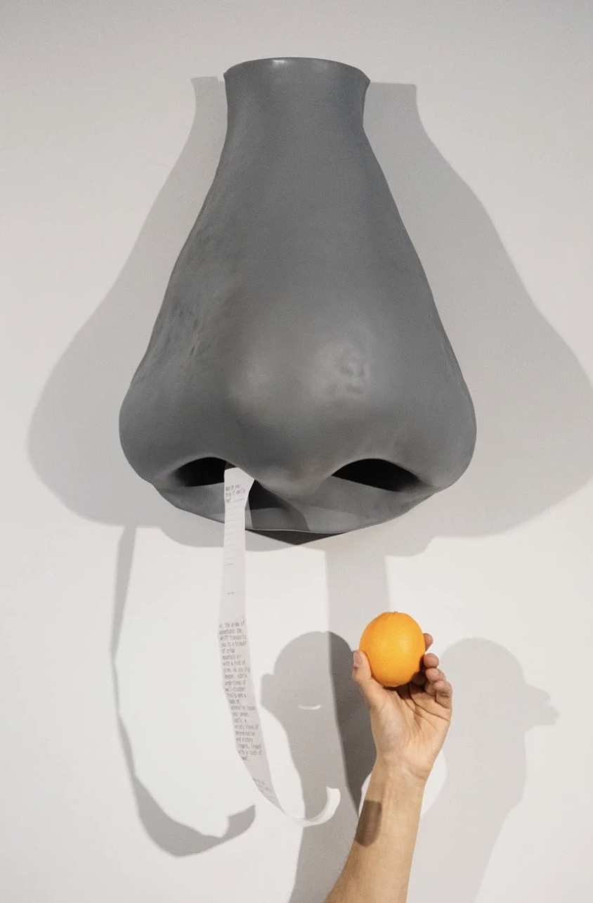

# Name: The Unedited

A bit of a random source of inspiration: https://www.olfactoryartkeller.com/performances/adnose

## Concept

When we're organizing our thoughts, especially when we're typing on a keyboard, that whole act is “**edited” and ”disguised“.** We always rephrase and polish things to present the version we're "supposed" to show (like always typing "I'm fine").

So this installation **rejects all that editing** andinsists on outputting the **"unedited" original version** instead.

## Layout

**· The Input Zone:**

1. The "truth" button --- for the user to choose their real emotional state
2. The "lie" keyboard --- for typing their "public, edited" language
3. The guidance screen (in front of the keyboard) ---  set social scenario and ask questions to user, and shows what they're typing in real-time

**· The Output Zone** (on the wall)**:**

1. The printer --- acting as the final "truth" speaker
2. Mapping --- sets the 

   *true*

    mood of the room (using filmic footages like "crying eyes")
3. Soundscape

## The Narrative

**Step 1: Truth**

The user approaches the desk and turn the "truth" button to their real mood (e.g., turn to "Anxious")

**Step 2: Atmosphere**

The entire room's projection and soundscape shift to match (e.g., the walls are now filled with "anxious eyes" and the sound of a "heartbeat")

**Step 3: Lie**

* The guidance screen presents the social trigger:

> "Hey! How are you doing?"

Audience use the keyboard to type their "social disguise" :

> "I'm good, don't worry."

**Step 4: Resolution**

* The system detects the 

  **major conflict**

   (button=Anxious vs. keyboard=Fine)
* The printer on the wall prints the "unedited" truth: 

> the opposite words: "I'm falling apart!" & glitch patterns

**Step 6: Takeaway**

The printed receipt hangs from the wall. The user is invited to take it with them.
