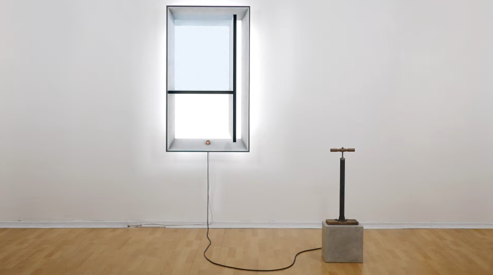
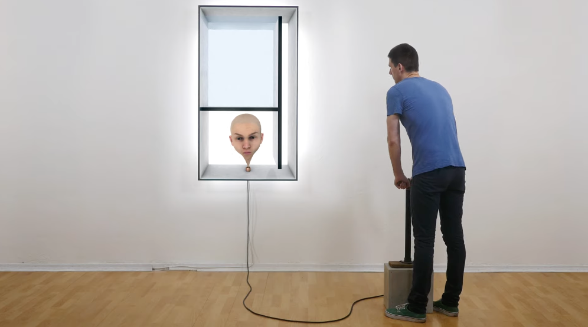
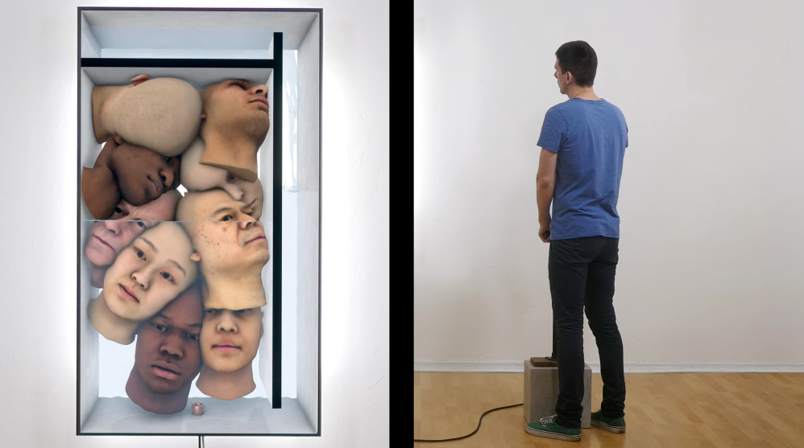
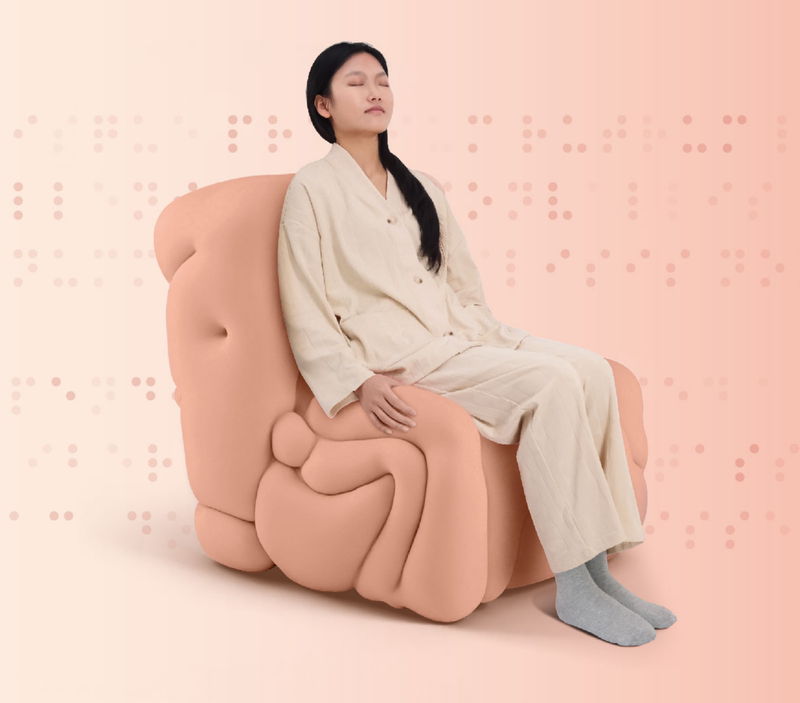

# LIVING SPACE

### interactive art installation

<https://www.youtube.com/watch?v=1aULkE1tMDQ>

### Description

Background: by 2050, the global population will approach 10 billion, rapidly consuming finite resources and causing irreversible environmental damage.

Through the "unconscious design", the work reveals the massive chasm between humanity's "cognition" (our awareness of overpopulation and its consequences) and our actual "actions" (our behavior).

Its core interactive mechanism functions as an ingenious "trap", it utilizes habitual, everyday objects. This design induces subconscious, instinctive responses from the participant. However, within the installation's feedback loop, these seemingly natural and harmless behaviors are revealed to be incredibly destructive, for example, relentlessly consuming resources and encroaching on others' living space merely for the sake of "continuation."

"LIVING SPACE" is a deeply impactful, reflective work. It forces us to pause and interrogate the behavioral patterns we accept without thinking, and to reflect on their collective consequences.

### Why I choose

My core reason for choosing "LIVING SPACE" is its perfect unity of controller design and artistic theme. At the same time, through its incredibly vivid visual presentation, it forces us to directly witness the consequences of overpopulation and resource depletion.

For standard Alt+Ctrl games, player's interaction is typically "conscious", however, in "LIVING SPACE", the interaction is "unconscious", participants are driven by habit and instinct to operate the controller. This design brilliantly echoes the work's theme, allowing the participant to unconsciously become the perpetrator.

Therefore, the controller is no longer a game tool, but a "psychological probe" revealing our inner blind spots. And this design, which transforms interaction into unconscious behavior, is what I love most about the project and is also a direction I am very interested in.

\---------------------------------------------------------------------------------------------

# My Alt+Ctrl Interface

I’ve always been fascinated by touch, it is our most direct connection to the world, yet often the most neglected sense. During my research, I encountered patients with tactile agnosia. They can see and hear, but struggle to truly *feel* the intensity or meaning of touch. It made me wonder: when the body can no longer express emotion, how might we relearn the language of touch?

I created a responsive sofa that reacts to a handshake. When a user holds its armrest, pressure sensors capture the grip intensity, while an algorithm analyzes whether the touch is too firm or too weak. The sofa then adjusts its physical form through motorized mechanisms, feeding the response back to the body. 

I chose furniture as the medium, embedding pressure sensors in the armrest, to introduce the idea of touch in a subtle way. Rather than a medical device, I wanted it to appear as nothing more than an ordinary sofa(something that belongs to daily life), so people can naturally lean on.

This approach also follows a kind of unconscious design. I didn’t want patients to be constantly reminded of their condition, instead, I wanted them to reconnect with their own bodies through everyday action.

The current version remains in a theoretical and technical stage, feels quiet and rational, more like a therapeutic tool. My next step is to give it more vitality and playfulness, turning tactile learning into an engaging, interactive experience rather than mere rehabilitation.

### How Furniture Guides Human Sensing

### Prototype

**Input:**

pressure sensor - the strength of handshake

**Output:**

air pump - cushion hardness

rotating module - backrest angle

lifting rod - seat height

sliding track - seat depth

### **Exploded View**

### User Journey

### **Future Iterations**

**Inspiration**：https://shakethatbutton.com/yogaie/

To bring more emotional resonance into the experience, I want to introduce a projection system: A fireplace, the state of the firelight is controlled by the force of the handshake.

**1. Initial State** 

Sofa: Neutral form. 

Fireplace: The screen is dim, with faint embers flickering in the dark. 

Sound: A cool, distant wind fills the silence.

**2. Grip Too Weak** 

Sofa: Slightly rigid, unresponsive. 

Fireplace: Embers remain dull, with almost no change. 

Sound: The cold wind continues.

**3. Grip Too Strong** 

Sofa: Compressed shape, creating gentle resistance. 

Fireplace: Embers flare up suddenly, then *“puff”* out, leaving a trace of smoke. 

Sound: A brief burst of flame followed by silence.

**4. “Just Right” Grip** 

Sofa: Soft, balanced, responsive. 

Fireplace: The embers awaken, flames rise slowly, and the space fills with warm light. 

Sound: The soft “crackle” of fire.
