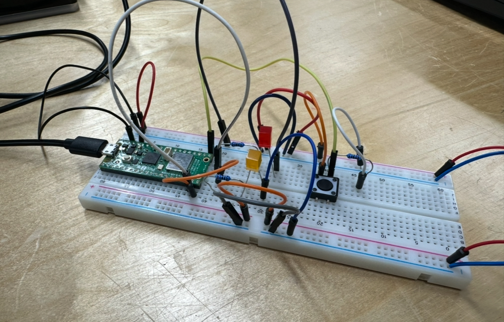
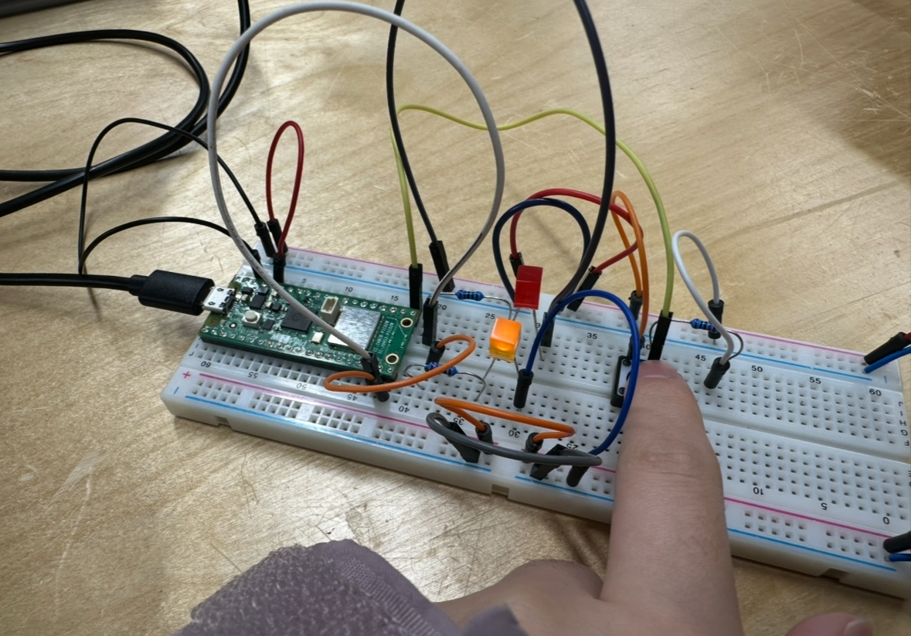
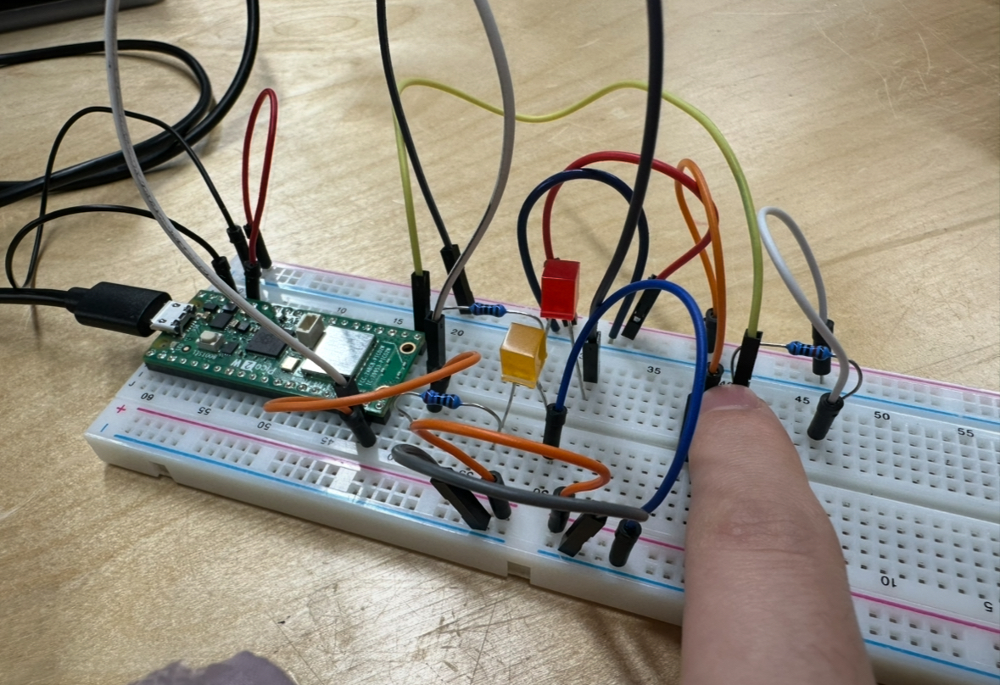

## **My circuit**



1. When the program starts, both LEDs are off



2. When the switch is pressed once, the first LED turns on


3. When the switch is pressed the second time, the second LED turns on (the first one should also still be on)



4. When the switch is pressed the third time, both LEDs turn off


## **My Code**

```
int button;
int pressNum;
int lastB;

void setup() {
  pinMode(15,OUTPUT);
  pinMode(14,OUTPUT);
  pinMode(16,INPUT);
  digitalWrite(15,LOW);
  digitalWrite(14,LOW);
  Serial.begin(9600);
}

void loop() {
  button = digitalRead(16);
  Serial.println(button);
  if(button != lastB ){
    if(button == 1){
      pressNum++;
      if(pressNum >2){
        pressNum = 0;
      }
      LEDupdate();
    }
  }
  lastB = button;
  delay(50);
}

void LEDupdate(){
  if(pressNum == 0){
    digitalWrite(15,LOW);
    digitalWrite(14,LOW);
  }
  if(pressNum == 1){
    digitalWrite(15,HIGH);
    digitalWrite(14,LOW);
  }
   if(pressNum == 2){
    digitalWrite(15,HIGH);
    digitalWrite(14,HIGH);
  }
}
```
