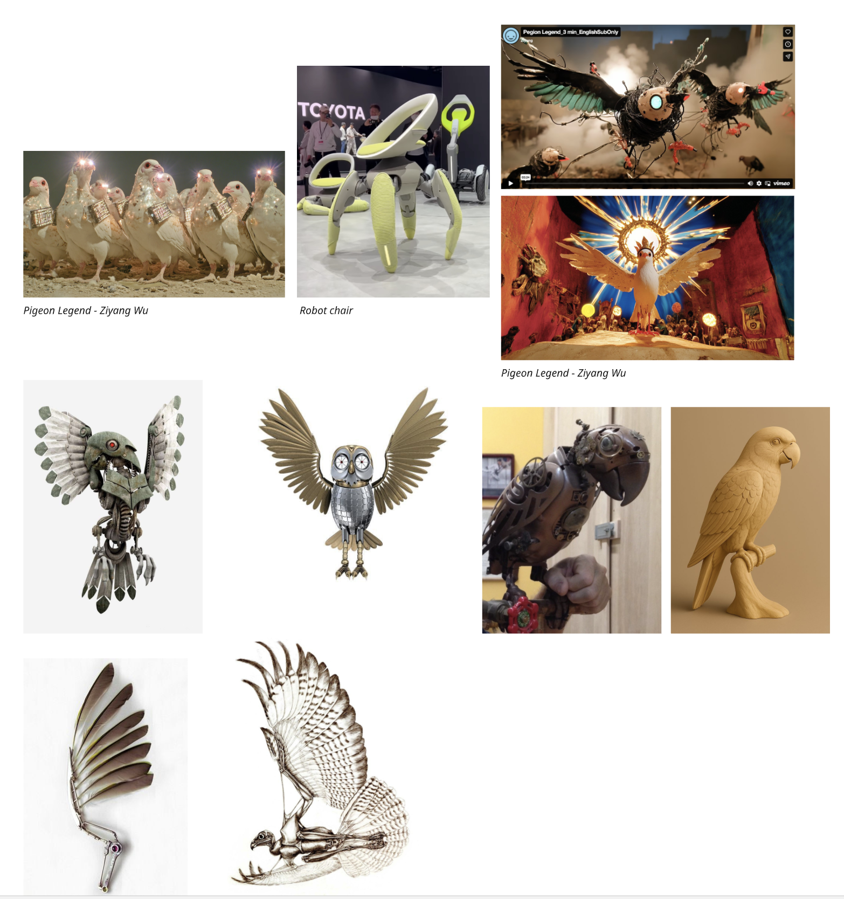

* Some short thoughts on what you would like to explore and work with conceptually and technically. What is it that you want to make? How does it look like? What does it do?
* Some references (artworks/projects that are similar to what you would like to do)
* Initial list of parts and components you think you will need

## ***What I want to make?***

*I want to make a Parrot Robot to commemorate an Africa gray Parrot that once accompanied me for a period of time.* 

I want to explore the boundary between a robot and a bird with warmth.

## ***What should it looks like?***

***A round and smooth bird shape? 2 legs and 2 wings?***

## ***What functions does it have?***

* *Is love control？*

  ***Use gesture recognition to control Robot‘s actions***
*  *Parrot‘s mood problem*

  ***When no one is around, it preens the feathers on its neck.***
*  *Parrot can has simple consversations*
*  *Parrot doesn’t trust you*

  ***It will avoid you when you get close.***
