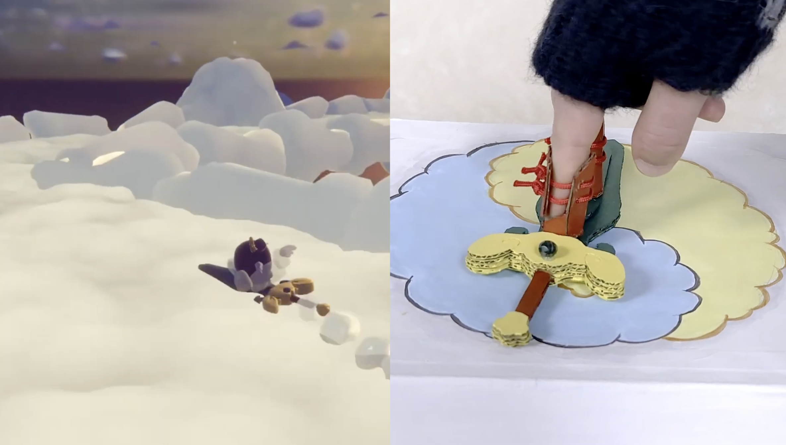

**1. Find an interesting existing Alt+Ctrl Interface**

#### **Dance of Sky Carver**

<https://www.youtube.com/watch?v=kYjf8OcqRd0>



Dance of Sky Carver is a hybrid game that combines a physical controller with a digital game. Players change the way the spaceship moves in the game by manipulating a paper-craft spaceship. The spaceship‘s movement and altitude directly responds to the player's physical gestures. 

**ORBITAL by incontrolab**


Infrared motion sensor from a mouse

##### **2. Come up with a concept for your own Alt+Ctrl Interface**

I want to make a robotic parrot that can perform some basic interactions.

**What's the defination of a Robot?**

> *Something can sensing, processing and actuating.*

For example, when someone passes by, it says “Ciao bella,” which I think will require an infrared motion sensor(PIR sensor).
I also want it to move around under human control, but stop automatically when it reaches the edge of a table , this might need a distance sensor or a proximity sensor.
