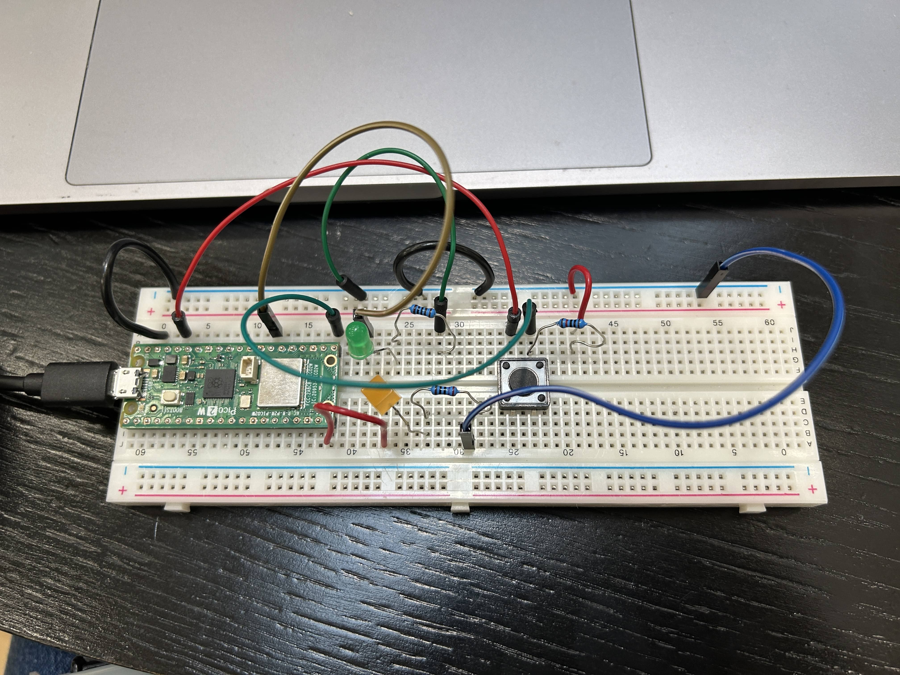

Hi This is my first week's homework.

🤔 At begnnig I faced some problems for logic understanding, I thought buttons in Arduino/Rasperry circuit are similliar with buttons in physical circuit, they should control whether the circuit is closed. If I used the same logic for homework, then I realized it doesn't work. So I search online to understand the principle of how button be used in Arduino.

I studied the use of ***Botton*** is for utilizing the voltage difference to give signal through input pin, to control whether other pin ports output voltage.  And I also try to figure out the principle of ***Pull_up resistors*** and ***Pull_down resistors***.

When I start to write code after connecting circult, I only count when button is High, then I found the LED light keep shinning after the first-time I pressed the button. After searching some materials, I know need to set up another value shows the condition aftering press the button. It turn to normal after I add the value "LastButtonState", it will equal to Button's value after each loop.



##### **My code**

```
int button;
int light;
int lastButtonState;
int i=0;

void setup(){
pinMode(16,INPUT);//button
pinMode(15,OUTPUT);//yellow led
pinMode(21,OUTPUT);//green led
}

void loop(){
  button = digitalRead(16);
  
  if(button == HIGH && lastButtonState == LOW){
    i++;
    if(i>2) {
    i=0;}
    delay(200);
  }
  lastButtonState = button;

  if(i == 0){
    digitalWrite(15,HIGH);
    digitalWrite(21,LOW);
  }
  else if(i == 1){
    digitalWrite(15,HIGH);
    digitalWrite(21,HIGH);
  }
  else if(i == 2){
    digitalWrite(15,LOW);
    digitalWrite(21,LOW);
  }
}
```
